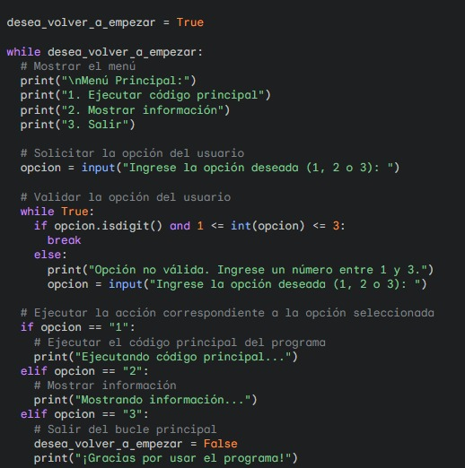

## Bonus track:

### Ejemplo de bucles anidados o encapsulados (while dentro de otro while)



Un ejemplo de la utilización de bucles anidados puede ser un menú con opciones. En este caso, se tiene un bucle principal que se ejecuta mientras la variable **desea_volver_a_empezar** sea **true**. Dentro de este bucle, se muestra un menú de opciones para que el usuario elija. Luego, hay otro bucle **while** que valida la opción seleccionada. Finalmente, se ejecuta la opción seleccionada utilizando una estructura **if**. Si se elige la opción 3, la variable del primer bucle se cambia a **false**, lo que termina el programa.

---

### Ejercicio 1

Escribe un programa que cuente una historia interactiva (del estilo de los libros "Elije tu propia aventura"), en el que el lector vaya leyendo la historia y llegado a cierto punto, tenga que elegir como sigue la historia. Dependiendo de las elecciones tomadas,  tendra diferentes finales. 

#### Ejemplo:

>>"El Viaje de Programación en Python"
>>
>>Eres un estudiante de la UBP en General Levalle y te has inscrito en el curso de programación I en Python. Estás emocionado por aprender un nuevo lenguaje de programación y explorar el mundo de la informática.
>>
>>Capítulo 1: El Comienzo
>>
>>Comienzas el curso de programación y te encuentras con dos profesores ntusiastas que te introduce a los conceptos básicos de Python. Te enfrentas a desafíos emocionantes y aprendes a escribir tus primeros programas. ¿Quieres seguir adelante con el curso? (Ve al Capítulo 2 apretando la tecla 2 y Enter ) ¿O te sientes abrumado y decides abandonar? (Aprieta la tecla 3 y Enter)
>>
>>Capítulo 2: La Aventura Continúa
>>
>>Decides continuar con el curso y te sumerges más profundamente en el mundo de Python. Aprendes sobre estructuras de datos, funciones y bucles mientras resuelves problemas cada vez más complejos. Tu entusiasmo por la programación crece a medida que adquieres nuevas habilidades. ¿Quieres seguir adelante con el curso y enfrentar el desafío final del proyecto final? (Aprieta la tecla 4 Enter ) ¿O te sientes frustrado y decides renunciar? (Aprieta la tecla 3 y Enter )
>>
>>Capítulo 3: El Desafío Final
>>
>>Llega el momento de enfrentar el proyecto final del curso. Te enfrentas a un problema complicado que requiere todas las habilidades que has aprendido hasta ahora. Trabajas duro y, con determinación, logras completar el proyecto con éxito. Tu confianza en tus habilidades de programación está en su punto más alto y estás listo para enfrentar nuevos desafíos en el futuro. ¡Felicidades, has alcanzado el Final Feliz!
>>
>>Final Triste: Decides abandonar el curso de programación y te sientes desanimado por no haber alcanzado tus metas. Sin embargo, con el tiempo, te das cuenta de que todavía hay oportunidades para aprender y crecer en el mundo de la informática.
>>

```python
#Resolución del ejercicio 1
```

hasta 7/6/2024 