## ¡Debugger en Python!

 Un **depurador** (en inglés: debugger) es una herramienta fundamental para los desarrolladores de software, ya que les permite **detectar y corregir errores** en sus programas. Funciona como un programa que se ejecuta junto al programa que se quiere depurar, permitiendo al usuario **observar su comportamiento paso a paso y analizar el estado de las variables** en cada momento.

#### En visual Studio Code podemos acceder a esta función tocando F5 y siguiendo los siguientes pasos:

1. Debemos colocar un punto de interrupción previamente a ejecutar el depurador, 
indicándole a Visual Studio Code donde parará de ejecutarse nuestro código, esto se 
hace poniendo el mouse a la izquierda del numero de línea(verán que aparece un 
punto rojo) y al apretar este quedará fijado!

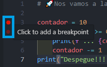

2. Posterior a eso tendremos que tocar la tecla “F5” (o función + F5) para acceder a las 
opciones de depuración. Aquí como vemos en la imagen tenemos una sugerida 
“Python Debugger” o podremos instalar extensiones. Debemos tocar en la sugerida

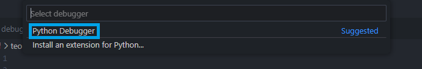

3. Luego de tocar “Python Debugger” se nos abrirán más opciones, la que nos interesa 
por su practicidad es la primera, Archivo de Python que depurará el archivo de Python
activo actualmente. Luego de tocar esa opción ya entraremos en el modo depurador o 
debugger.

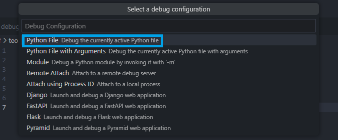

4. ¿Cómo sabemos si hicimos todo correctamente y estamos en el modo depuracion? Lo 
podemos notar por 3 cosas, el color de la barra inferior de Visual Studio Code cambio 
de color, sumado a eso a nuestra izquierda nos apareceran las variables Locales y se 
nos habra abierto un nuevo menu con opciones para la depuracion

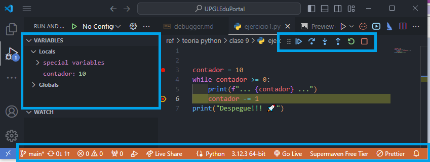

---
## Explicando cada parte del depurador 

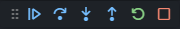

Al entrar en el modo depurador nos encontramos con este menú compuesto de 6 botones que nos facilitaran el uso del depurador, de Izquierda a Derecha tenemos los siguientes:

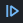
1. **Continuar (F5)**: Este botón hará un giro completo al código y se volverá a parar en 
el Stop (interrupción) colocado, tengan en cuenta que si hay un input de por medio 
como en este caso, se parará ahí hasta que el usuario ingrese el valor, después seguirá
el flujo normal.

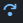
2. **Depurar paso a paso por procedimientos (F10)**: esta opción nos permitirá ir paso a 
paso por nuestro código, veremos que al tocar F10 o el botón en el código la línea
seleccionada(con amarillo) irá siguiendo el flujo del código, a solo una linea por vez. Si 
la línea es una llamada a una función, ejecuta la función entera y detiene la ejecución 
en la siguiente línea del nivel actual (no entra en la función)

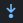
3. **Depurar paso a paso por instrucciones (F11):** esta opción nos permitirá ir paso a 
paso por nuestro código, veremos que al tocar F11 o el botón en el código la línea
seleccionada (con amarillo) irá siguiendo el flujo del código, a solo una linea por vez. 
Entra en la llamada de la función en la siguiente línea de código. Si la línea no es una 
llamada a función, actúa como "Paso por Paso

4. **Salir de la depuración (Shift + F11):** Continua la ejecución del programa hasta salir 
de la función actual y detenerse en la línea siguiente del llamador.

5. **Reiniciar (Ctrl+Shift+F5):** Reinicia la sesión de depuración desde el inicio. Detiene 
la ejecución actual y comienza nuevamente desde el punto de entrada del programa.

6. **Detener (Ctrl+F5):** Detiene la sesión de depuración y termina la ejecución del 
programa.

---

## Barra de Variables 

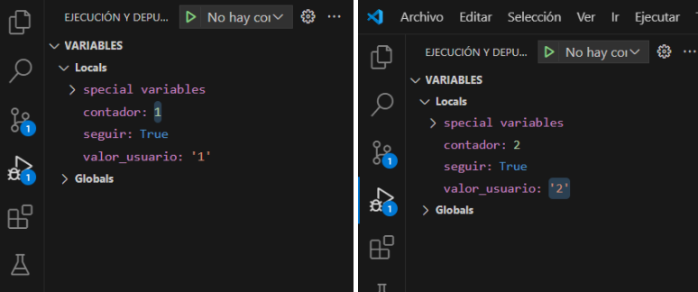

Al ejecutar el depurador a la izquierda aparecerá un nuevo menú con el valor actual de las variables mientras se va ejecutando el codigo, lo que nos permite un mayor control sin necesidad de colocar print para ver el valor de las mismas por medio de la terminal. En este caso en la imagen de la izquierda tenemos la primera iteración del While, donde el usuario coloco 1 como valor y a su derecha tenemos la segunda iteración donde el usuario coloco 2 como iteración.

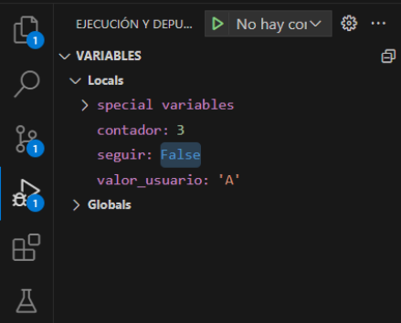

En este ejemplo vemos como el usuario ingreso “A” y por ende el flujo del programa entro dentro del if y terminará con el while al cambiar la condición de seguir a False.

**Recuerden:** ¡Las variables que vemos en este menú están ordenadas alfabéticamente!

## ¿Por qué se llama Debugger?

El término "debugger" proviene del verbo inglés "to debug", que significa eliminar errores o fallos de un sistema. La etimología de "debug" se remonta a la palabra "bug" que, en inglés, significa "bicho" o "insecto". En el contexto de la informática, "bug" se refiere a un error o fallo en el software o hardware. La historia cuenta que uno de los primeros usos del término "bug" en la informática se debe a Grace Hopper, una pionera de la programación. En 1947, mientras trabajaba en la computadora Mark II en la Universidad de Harvard, Hopper y su equipo descubrieron que un error en el funcionamiento de la máquina se debía a una polilla atrapada dentro de uno de los relés.

Retiraron el insecto y lo pegaron en el cuaderno de registro con la anotación "First actual case of bug being found" (Primer caso real de un bug encontrado). Aunque la palabra "bug" ya se había utilizado anteriormente en ingeniería, este incidente popularizó el término en el ámbito de la informática.

Por lo tanto, "debugging" se refiere al proceso de identificar y eliminar estos "bugs" o errores en los programas. El "debugger" es la herramienta o el programa utilizado para llevar a cabo esta tarea, permitiendo a los programadores ejecutar y revisar su código para encontrar y corregir errores. Así, el nombre "debugger" refleja su función principal de "depurar" el código, eliminando los errores para asegurar su correcto funcionamiento.

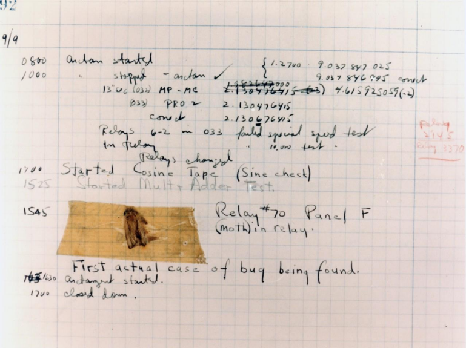